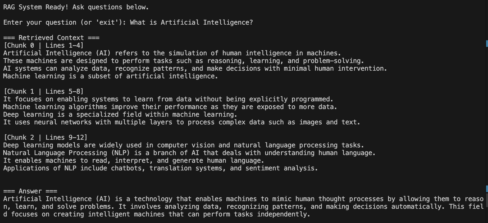
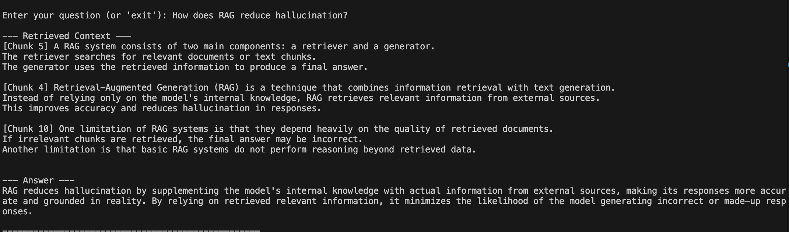
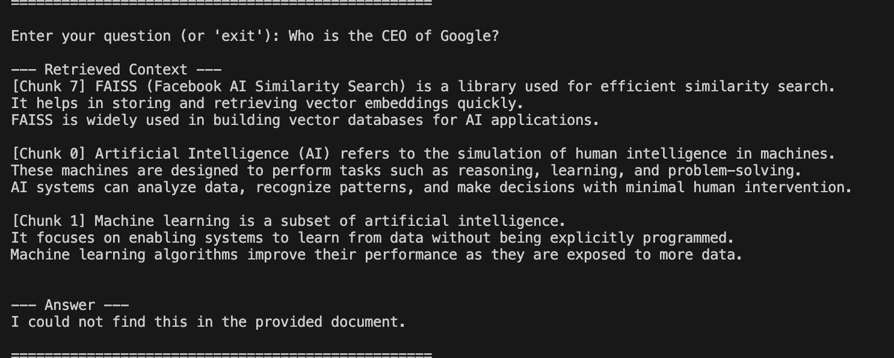

# RAG Q&A System

## Project Overview

This project implements a Retrieval-Augmented Generation (RAG) based Question Answering system.  
The system processes a given `.txt` document and answers user queries by retrieving relevant information and generating responses grounded strictly in the provided content.

The pipeline includes:
- Document ingestion and chunking
- Text embedding
- Vector storage using FAISS
- Similarity-based retrieval
- LLM-based answer generation with fallback handling

## Setup Instructions

### 1. Create and Activate Environment (Conda)

conda create -n rag-env python=3.10  
conda activate rag-env  

### 2. Install Dependencies

pip install -r requirements.txt  

### 3. Set API Key (Groq)

export GROQ_API_KEY="your_api_key_here"  

### 4. Run the Application

python rag_pipeline.py  

## Required Libraries

- sentence-transformers  
- faiss-cpu  
- numpy  
- groq  
- langchain  
- langchain-community  
- openai  

## Architecture Breakdown

Document → Chunking → Embedding → FAISS Index  
Query → Query Embedding → Similarity Search → Top-K Chunks  
Prompt + LLM → Final Answer  

##  Proof of Execution

### Screenshot 1: Basic Query
Example: What is Artificial Intelligence?  

### Screenshot 2: Advanced Query
Example: How does RAG reduce hallucination and what are its limitations?  

### Screenshot 3: Fallback Case
Example: Who is the CEO of Google?  

## Discussion Questions

### 1. Why are text embeddings necessary for an effective retrieval system?

Text embeddings convert textual data into numerical vectors, allowing semantic similarity comparison. This enables the system to retrieve contextually relevant information instead of relying on keyword matching.

### 2. Why use a RAG approach instead of simply pasting the entire document into the LLM's prompt?

- Avoids token limitations  
- Improves efficiency  
- Reduces noise in context  
- Provides more accurate and relevant answers  

### 3. How does chunk size impact the quality and accuracy of the retrieval phase?

- Smaller chunks → more precise retrieval but less context  
- Larger chunks → more context but reduced precision  

An optimal chunk size balances both (3–5 lines in this project).

### 4. What are the inherent limitations of this RAG setup?

- Depends on retrieval quality  
- Cannot reason beyond retrieved data  
- May fail if relevant chunks are not retrieved  
- No re-ranking or advanced retrieval optimization  

## Features

- Custom chunking with metadata (Chunk ID + line range)  
- Semantic search using embeddings  
- FAISS-based vector database  
- Grounded answer generation  
- Fallback handling for unknown queries  
- Clean CLI interface  

## Project Structure

RAG-QA-System/  
├── rag_pipeline.py   
├── README.md  
├── requirements.txt  
└── data/  
    └── document.txt  

## Conclusion

This project demonstrates a complete implementation of a foundational RAG system, showcasing how retrieval and generation can be combined to produce accurate, context-aware responses while minimizing hallucinations.